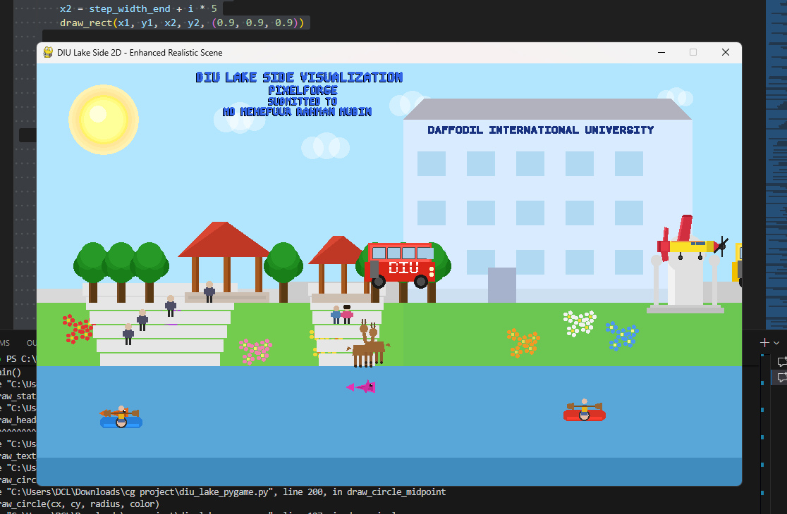

# DIU Lake Side Visualization - Computer Graphics Project

A 2D visualization of the Daffodil International University (DIU) lakeside scene implemented using OpenGL and Pygame. This project demonstrates various computer graphics algorithms and rendering techniques.

## 📸 Screenshot



*Add your screenshot.png file to the project directory*

## 🎯 Project Overview

This computer graphics project creates a highly detailed animated lakeside scene featuring:
- **Building**: Main DIU building with university name displayed using DDA algorithm
- **Natural Elements**: Trees, grass, lake, colorful flower gardens, sun with glow effect, and transparent clouds
- **Structures**: Two decorative gazebos, PT-6 aircraft monument on elevated pedestal, stone pathways and dual staircases
- **People**: Static figures and a romantic couple sitting on the stairs
- **Animated Objects**: Two DIU buses, three kayaks with paddlers, eight jumping fish, two walking deer, flying PT-6 aircraft
- **Advanced Graphics**: DDA line algorithm, Midpoint Circle algorithm (Bresenham's), alpha blending for transparency, smooth 60 FPS animations

## 🔬 Computer Graphics Algorithms Implemented

### 1. DDA (Digital Differential Analyzer) Line Drawing Algorithm
- **Purpose**: Efficient line rendering without multiplication
- **Used For**: University name text on building, text rendering
- **Key Concept**: Incremental calculation using floating-point arithmetic
- **Location in Code**: `draw_line_dda()` function

### 2. Midpoint Circle Algorithm (Bresenham's Circle Algorithm)
- **Purpose**: Fast circle drawing using only integer arithmetic
- **Used For**: Sun, tree foliage, header text, various circular elements
- **Key Concept**: 8-way symmetry and decision parameter
- **Location in Code**: `draw_circle_midpoint()` function

### 3. Polygon Filling
- **Purpose**: Rendering filled shapes (buildings, trees, animals)
- **Used For**: Buildings, gazebos, kayaks, deer, fish
- **Location in Code**: `draw_polygon()` function

## 🎨 Key Features

### Static Elements
- **DIU Building**: Multi-story building with 15 windows, balconies, and university name rendered using DDA algorithm
- **Gazebos**: Two octagonal decorative gazebos with detailed pillars, roofs, and architectural features
- **Trees**: 7 trees including mix of regular rendering and Midpoint Circle algorithm implementations
- **Flower Gardens**: 40+ individual flowers in 6 different colors (red, pink, yellow, purple, orange, white) spread across left and right banks
- **PT-6 Monument**: Detailed aircraft monument on elevated pedestal with decorative arch support structure
- **Staircases**: Two sets of stone stairs - main wide stairs (left) and narrower romantic stairs (right) with a couple sitting
- **Paths**: Stone walkways connecting different areas of the lakeside
- **Sun & Clouds**: Realistic sun with multi-layered glow effect and 4 animated transparent clouds
- **People**: 4 static figures on left stairs and a romantic couple sitting on right stairs
- **Deer**: Two deer figures positioned on the lakeside

### Animated Elements (60 FPS Smooth Motion)
- **Buses**: Two DIU buses (yellow and red) moving at different speeds with "DIU" text, detailed windows, headlights, and wheels
- **Kayaks**: Three kayaks (red, orange, blue) with people and paddles moving across the lake at varying speeds
- **Fish**: Eight colorful fish (orange, blue, yellow, pink, green, magenta, purple, coral) jumping out of water with parabolic arcs and splash effects - 50% bigger than original with 57% higher jumps
- **Deer**: Two deer walking back and forth on the middle section of lakeside
- **Plane**: Detailed PT-6 aircraft flying across the sky with propeller blades and landing gear
- **Clouds**: Four transparent clouds drifting slowly across the sky at different altitudes and speeds

## 🛠️ Technologies Used

- **Python 3.x**: Programming language
- **Pygame**: Window management and event handling
- **PyOpenGL**: OpenGL bindings for Python
- **OpenGL 2D**: Graphics rendering API

## 📋 Prerequisites

Before running this project, ensure you have Python installed on your system (Python 3.6 or higher recommended).

### Required Libraries
- `pygame` (version 2.6.0 or higher)
- `PyOpenGL` (version 3.1.7 or higher)

All dependencies are listed in `requirements.txt` for easy installation.

## 🚀 Installation & Setup

### Step 1: Clone or Download the Project
```bash
cd "path/to/project/directory"
```

### Step 2: Create Virtual Environment (Recommended)
```bash
# Create virtual environment
python -m venv venv

# Activate virtual environment
# On Windows:
venv\Scripts\activate

# On macOS/Linux:
source venv/bin/activate
```

### Step 3: Install Required Packages

Using the requirements.txt file (recommended):
```bash
pip install -r requirements.txt
```

Or install packages individually:
```bash
pip install pygame PyOpenGL
```

To verify installation:
```bash
pip list | findstr "pygame\|PyOpenGL"
```

## ▶️ Running the Project

### Method 1: Using Virtual Environment (Recommended)
```bash
# Make sure virtual environment is activated
venv\Scripts\activate

# Run the project
python diu_lake_pygame.py
```

### Method 2: Direct Execution
```bash
python diu_lake_pygame.py
```

### Method 3: Using Python Launcher (Windows)
```bash
py diu_lake_pygame.py
```

## 🎮 Controls

- **ESC** or **Q**: Exit the application
- **Close Window (X)**: Exit the application

The scene runs automatically with all animations at **60 FPS** for smooth, video-like motion. All animated elements move at optimized speeds:
- Buses: 16.7 and 15.0 pixels/frame
- Kayaks: 8.3-10.0 pixels/frame  
- Plane: 20.0 pixels/frame
- Deer: 6.0-6.7 pixels/frame
- Clouds: 1.67 pixels/frame
- Fish: Smooth parabolic jumps with 55-pixel height

## 📁 Project Structure

```
cg project/
│
├── diu_lake_pygame.py      # Main Python file (1592 lines) with all code
├── requirements.txt        # Python package dependencies
├── README.md               # This file - comprehensive project documentation
├── venv/                   # Virtual environment (created after setup)
└── screenshot.png          # Screenshot of the visualization (add this)
```

## 📊 Scene Elements Count

### Total Scene Elements: 26 element types
- **Building**: 1 main structure with 15 windows
- **Gazebos**: 2 structures
- **Trees**: 7 trees (6 regular + 1 using Midpoint Circle Algorithm)
- **Flowers**: 40+ individual flowers in 6 colors
- **Staircases**: 2 sets (left wide stairs + right narrow stairs)
- **Paths**: 2 walkways
- **People**: 6 total (4 standing + 2 sitting as couple)
- **Buses**: 2 animated (yellow DIU bus + red bus)
- **Kayaks**: 3 animated with paddlers
- **Fish**: 8 animated jumping fish
- **Deer**: 2 animated walking
- **Plane**: 1 animated flying
- **Clouds**: 4 animated transparent
- **Sun**: 1 with multi-layer glow
- **Lake**: 1 with gradient depth effect
- **Grass Banks**: 2 (left and right)
- **PT-6 Monument**: 1 detailed aircraft memorial

## 🎓 Educational Value

This project demonstrates comprehensive understanding of:

1. **Computer Graphics Fundamentals**
   - 2D coordinate systems and transformations
   - Color models (RGB, RGBA) with alpha blending
   - Viewport and orthographic projection setup
   - Frame buffer and double buffering

2. **Line Drawing Algorithms**
   - DDA algorithm implementation from scratch
   - Incremental techniques for efficiency
   - Rasterization and pixel plotting concepts
   - Used for rendering text on buildings

3. **Circle Drawing Algorithms**
   - Midpoint/Bresenham's circle algorithm implementation
   - 8-way symmetry exploitation for efficiency
   - Decision parameter calculations
   - Used for sun, tree foliage, and circular text

4. **Animation Techniques**
   - Frame-based smooth animation at 60 FPS
   - State management for multiple objects
   - Timing and synchronization
   - Parabolic motion for fish jumps
   - Cyclic animations (deer walking, clouds drifting)

5. **OpenGL Programming**
   - Primitive shapes (GL_POINTS, GL_QUADS, GL_POLYGON, GL_TRIANGLE_FAN)
   - Color blending with GL_BLEND for transparency
   - 2D orthographic projection (gluOrtho2D)
   - Double buffering for flicker-free animation
   - Efficient rendering pipeline

6. **Software Engineering Practices**
   - Modular code organization with 50+ functions
   - Comprehensive documentation and comments
   - Global state management
   - Clean code structure and readability

## 📊 Code Organization

### Main Components

1. **Global Variables** (Lines 1-68)
   - Window configuration (1000x600 pixels)
   - Animation state variables for all moving objects
   - Position trackers (buses, kayaks, plane, deer, fish, clouds)
   - Fish arrays with 8 colors and jump states

2. **Drawing Primitives** (Lines 70-230)
   - `draw_rect()`: Filled rectangles for buildings, roads, bodies
   - `draw_polygon()`: Arbitrary polygons for complex shapes
   - `draw_circle()`: Filled circles with optional transparency
   - `draw_line_dda()`: **DDA line algorithm** implementation
   - `draw_circle_midpoint()`: **Midpoint circle algorithm** implementation

3. **Text Rendering** (Lines 232-450)
   - `draw_text()`: Simple block letters
   - `draw_text_dda()`: Text rendering using DDA lines
   - `draw_text_midpoint_circle()`: Text using circle algorithm
   - Character definitions for A-Z and numbers

4. **Scene Elements** (Lines 452-1200)
   - **Environment**: Sky, sun with glow, transparent clouds, lake with gradient
   - **Terrain**: Grass banks, flower gardens (40+ flowers in 6 colors)
   - **Infrastructure**: Building with 15 windows, two staircases with couple sitting
   - **Nature**: 7 trees (6 regular + 1 with Midpoint algorithm)
   - **Structures**: Two gazebos, PT-6 monument with arch
   - **People**: 4 standing figures, 1 romantic couple

5. **Animated Objects** (Lines 1200-1400)
   - **Buses**: Two detailed buses with DIU branding
   - **Kayaks**: Three kayaks with paddlers
   - **Fish**: Eight jumping fish with parabolic motion and splash
   - **Deer**: Two walking deer with directional movement
   - **Plane**: PT-6 aircraft with propeller and landing gear

6. **Main Loop** (Lines 1450-1592)
   - Pygame initialization and window setup
   - Event handling (ESC, Q, window close)
   - Animation updates (60 FPS timing)
   - Rendering pipeline (static + dynamic scenes)
   - Position updates for all animated elements

## 🎨 Color Scheme

The project uses a natural color palette:
- **Sky**: Light blue (0.7, 0.9, 1.0)
- **Water**: Blue gradient (0.35, 0.65, 0.85)
- **Grass**: Green (0.45, 0.8, 0.3)
- **Building**: Light blue-white (0.85, 0.92, 1.0)
- **Sun**: Yellow with glow (1.0, 1.0, 0.6)

## 🐛 Troubleshooting

### Issue: "ModuleNotFoundError: No module named 'pygame'"
**Solution**: Install dependencies using `pip install -r requirements.txt`

### Issue: "ModuleNotFoundError: No module named 'OpenGL'"
**Solution**: Install dependencies using `pip install -r requirements.txt`

### Issue: pip install fails
**Solution**: 
1. Upgrade pip: `python -m pip install --upgrade pip`
2. Try installing with admin privileges (Windows: Run terminal as Administrator)
3. For specific package issues, try: `pip install --upgrade pygame PyOpenGL`

### Issue: Application runs but shows black screen
**Solution**: Ensure your graphics drivers are up to date and support OpenGL 2.0+

### Issue: Animation is too fast or too slow
**Solution**: The animation runs at 60 FPS. Check if your system is throttling the application.

## 👨‍💻 Project Information

- **Project Name**: DIU Lake Side Visualization
- **Team**: PixelForge
- **Course**: Computer Graphics
- **Institution**: Daffodil International University
- **Submitted To**: Md Mehefujur Rahman Mubin

## 📝 Assignment Requirements Met

✅ Implementation of DDA Line Drawing Algorithm  
✅ Implementation of Midpoint Circle Algorithm  
✅ 2D Scene with multiple objects  
✅ Animation of multiple elements  
✅ Proper code documentation  
✅ README with setup instructions  

## 🔄 Future Enhancements

Possible improvements for this project:
- Add day/night cycle with dynamic sky color transitions
- Implement Bezier curves for smoother curved paths
- Add user interaction (click to add objects, pause/resume animations)
- Include sound effects (water splashing, birds chirping, vehicle sounds)
- Add weather effects (rain, snow, fog with particle systems)
- Implement dynamic shadow casting based on sun position
- Add more wildlife (birds flying, butterflies near flowers)
- Create a menu system for controlling animation speeds
- Add seasonal changes (autumn leaves, winter snow)
- Implement water reflections for kayaks and buildings
- Add zoom and pan camera controls
- Create a performance metrics display (FPS counter, object count)

## 🎯 Key Achievements

✨ **Technical Highlights:**
- **1592 lines** of well-documented Python code
- **50+ custom functions** for modular design
- **26 distinct element types** creating a rich, detailed scene
- **60 FPS smooth animation** optimized for visual quality
- **8 fish animations** with realistic parabolic jump physics
- **Alpha blending** for cloud transparency effects
- **Dual algorithm implementation** (DDA + Midpoint Circle)
- **Zero external dependencies** beyond Pygame and PyOpenGL

## 📚 References

- Computer Graphics: Principles and Practice
- OpenGL Programming Guide
- Pygame Documentation
- Bresenham's and DDA Algorithm tutorials

## 📄 License

This is an educational project created for academic purposes at Daffodil International University.

---

**Note**: Make sure to add a screenshot of your running application as `screenshot.png` in the project directory for the README to display the visualization properly.

For any questions or issues, please contact the project team.
